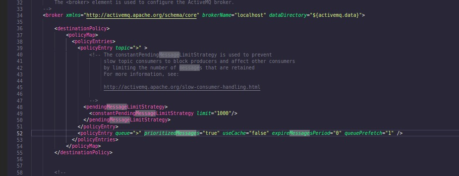
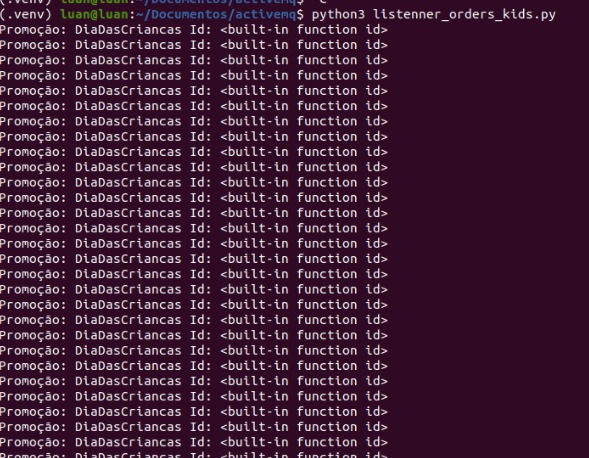
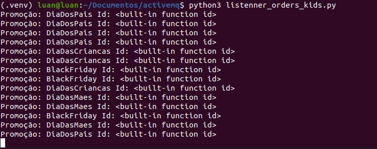
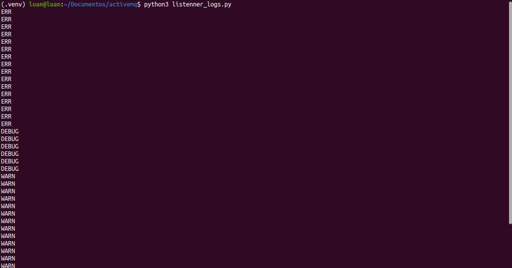

# Tópicos e Filas com ActiveMQ Python

## Instalar o ActiveMQ no Ubuntu

- [ActiveMQ](https://www.vultr.com/docs/install-apache-activemq-on-ubuntu-20-04/)

## Ajustes necessários no arquivo activemq.xml

Esse arquivo pode ser encontrado dentro da pasta /opt/activemq/conf

Permitir ordenar por prioridade adicionar a linha a seguir como na imagem

```
<policyEntry queue=">" prioritizedMessages="true" useCache="false" expireMessagesPeriod="0" queuePrefetch="1" />
```



---

Permitir adicionar a politica de acesso adicionar as linhas a seguir como na imagem

```
<plugins>
    <simpleAuthenticationPlugin anonymousAccessAllowed="false">
        <users>
            <authenticationUser username="admin" password="admin" groups="users,admins"/>
            <authenticationUser username="user" password="senha" groups="users"/>
            <authenticationUser username="guest" password="senha" groups="guests"/>
        </users>
    </simpleAuthenticationPlugin>
</plugins>
```


## Rode o projeto

- Clone o projeto

  ```
  git clone git@github.com:LuanPetruitis/activemq-python.git
  ```

- Entre na Pasta

  ```
  cd activemq-python
  ```

- Instale o ambiente virtual no python

  ```
  python3 -m venv .venv
  ```

- Ative o ambiente virtual no python

  ```
  source .venv/bin/activate
  ```

- Instale as dependência

  ```
  pip3 install -r requirements.txt
  ```

- Para publicar as mensagens utilize o comando a seguir

  ```
  python3 publisher.py
  ```

- Para ler os tópicos de Dia das Crianças

  ```
  python3 listenner_orders_kids.py
  ```

- Para ler a fila de logs
  ```
  python3 listenner_logs.py
  ```

# Funcionamento

- Lendo tópicos com filtro
  

- Lendo tópicos sem filtro

  

- Lendo fila ordenada por prioridade

  
